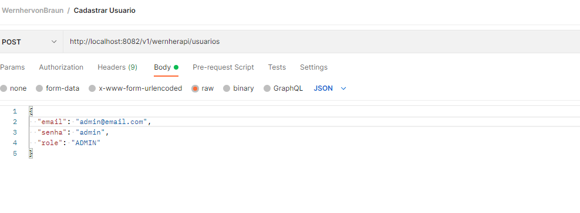
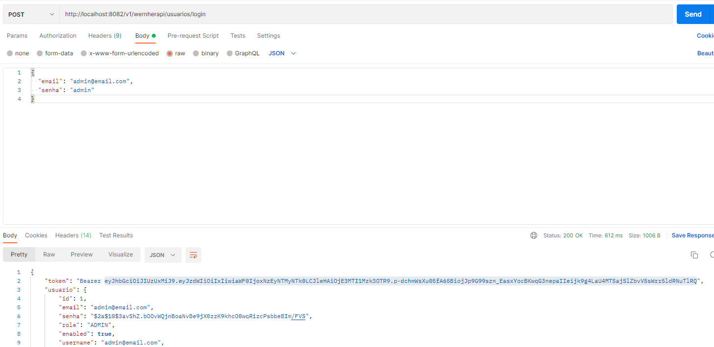
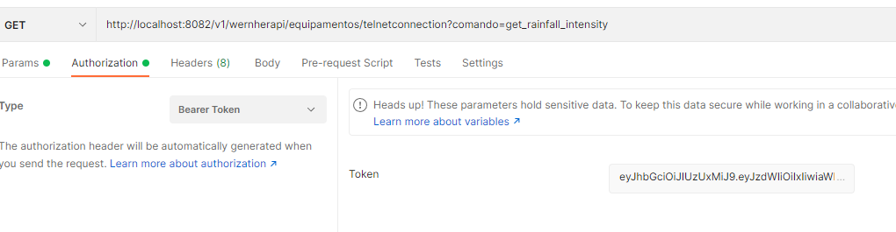
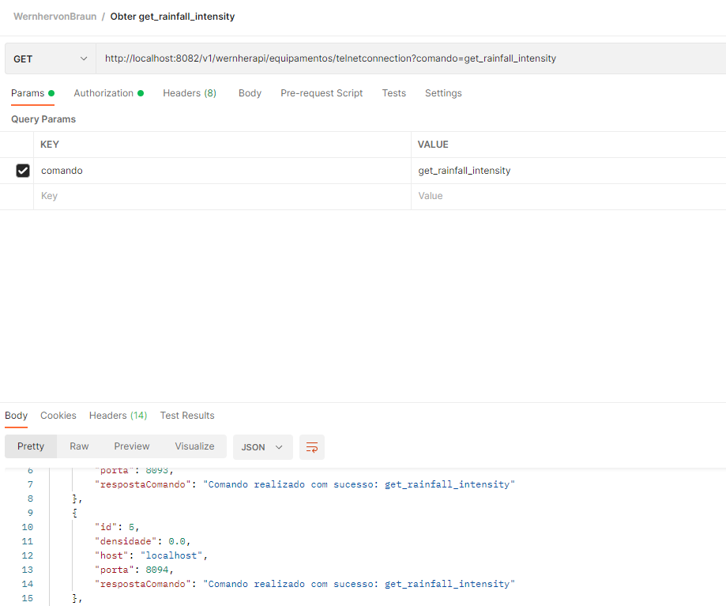

# INSTRUÇÕES BÁSICAS E ESCOLHAS DO PROJETO

## Opções técnicas

Visando atender a todos os requisitos exigidos no desafio, apresento aqui as escolhas técnicas mais relevantes desta aplicação:

- Spring Boot: Foi escolhido como Framework com gerenciador de dependências Maven, o tradicional para construção de APIs Java.
- Docker: Escolhi a ferramenta por ser mais prático para exportar APIs, fornecer para outras pessoas. É uma boa prática a utilização de container, uma vez que tendo o docker, todo o resto é gerenciado pelo yml, o risco de haver problemas com banco e outras configurações é minimizado.
- Flyway: Escolhi essa ferramenta para facilitar a utilização da API, uma vez que os dados das entidades são persistidos já ao inicializar a aplicação. Não fiz a inserção de usuários devido a questões de criptografia das senhas, sendo mais prático inserir pelo Postman, conforme explicarei posteriormente neste documento.
- Swagger: Escolhi como ferramenta de documentação da API, facilita bastante a compreensão. Basta acessar por localhost:{porta}/swagger-ui/index.html
- JUnit e Mockito: Utilizado para realização de testes unitários automatizados. Foram aplicados apenas ao que diz respeito à entidade equipamento. Primeiro, por uma questão de tempo, segundo porque para executar a aplicação, a orientação será criar um usuário manualmente e depois autenticá-lo, então o próprio uso da API acaba testando indiretamente por outra ferramente. Além disso, testar a autenticação é um pouco mais trabalhoso, porque exige que tenha uma abordagem um pouco mais detalhidas quanto aos mocks de dados.
- JWT: Para gerar token, escolhi essa tecnologia disponibilizada no pacote io.jsonwebtoken. É ele quem fornece também um algoritmo de criptografia para guardar a senha no banco. Também é necessário utilizar o Spring Security para filtrar as requisições, definir endpoints que precisam de autenticação ou não. 
- Sockets: Em vez de utilizar a classe TelnetClient do Apache Commons, achei mais interessante abordar os equipamentos como sockets de servidores, criando esses servidores em threads separadas da aplicação principal, e acessando-os por sockets dentro da API. É uma prática comum do protocolo TCP/IP

## Por dentro da aplicação: estrutura interna

Essa Aplicação é uma API monolítica em camadas.

### Controllers

Nesse pacote estão as classes controladoras da aplicação. São as classes responsáveis pelas ações após comando do usuário direcionado a um endpoint específico.

### DTO

Nessa pasta estão os dados que são serializados de fato em JSON, os dados trafegados para requisição e resposta. Costumo dividir os DTOs em Service e Controller, trafegando dados às vezes diferentes nas camadas. Nesse projeto específico optei por não diferenciar.

### Entities

Nessa pasta estão os arquivos de entidade, que são as classes persistidas para o banco.

### Exceptions

Pasta com as exceções personalizadas em nível de controle e serviço na aplicação.

### Repositories

Repositórios das entidades, interfaces do JPA que traduzem Java para SQL.

### Security

Dentro dessa pasta estão três pastas: config, filter e services. Na pasta config está a classe de configuração do Spring Boot para o security funcionar adequadamente. Na de Filter está o filtro, que é por onde passa cada requisição. Na classe Services estão utilidades do JWT e autenticação, funções como a de geração de token e de gerar criptografia para senhas.

### Services

Nela estão as classes de serviços, que são uma camada intermediária entre repository e controller

### Telnet

Contém as classes ThreadCliente, ThreadServer. Cada ThreadServer inicializa um ServerSocket e inicializa uma ThreadCliente, que espera ser criado um socket na aplicação.

### Resources/db/migration

Contém as queries SQL de migração do Flyway

### test

Contém todos os testes unitários para equipamentos.

## Testando a aplicação

### Crie um usuário
O endpoint de criação de usuário é o único para o qual uma requisiçaõ do tipo POST é liberada sem autenticação.

### Autentique esse usuário

Após criar o usuário, você deve autenticá-lo para receber o token que será usado em cada requisição.

O token é toda a parte destacada após o Bearer na imagem.

### Realize a requisição desejada

Por exemplo, a requisição responsável pelos sockets:

## Justificativas para os itens

- 1: A autenticação foi aplicada como mostrada anteriormente, por meio de um endpoint de login. Apliquei perfil de usuário e de administrador, pois é uma prática comum limitar mais um usuário por exemplo, e dar mais permissão ao administrador (não foi aplicado nessa API)
- 2: Para essa consideração, criei um método com filtragem, disponibilizado no repository da entidade Equipamento
- 3: Endpoint com final equipamentospredictweaterparachuva
- 4: Troquei o protocolo Telnet por simplesmente sockets. Vale lembrar que a classe TelnetClient é apenas uma herdeira de Socket. De maneira bem resumida, no Java o Telnet é como um Socket na porta 23. Optei por criar um servidor MultiThread imaginando como um projeto para futuro. No caso, restringi o método ao comando citado no arquivo do Instituto, mas deixei um RequestParam para o comando, pois sempre projeto pensando em continuidade. Em um futuro próximo, imaginaria a aplicação recebendo mais comandos, dando sentido a esse parâmetro na função.
